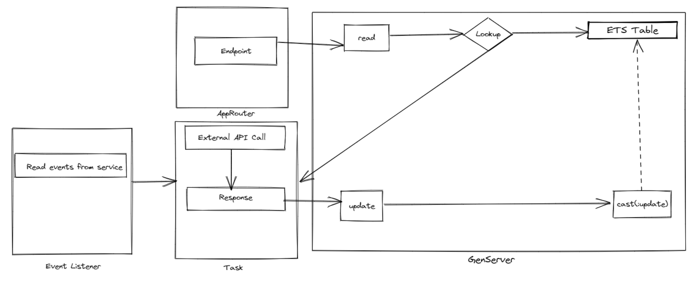

# Cache Service for APIs

### Service to cache the responses of the API calls to improve the resource consumption and processing time of the consuming application. 


### Where and When
The service will be called by the application instead of directly calling the external API.
It should be only called when the application wants to cache the response of the external API and there are methods to update the cached response either by consuming the events of external system or by the application itself.


### Prerequisites
Before the application uses the cache service, it needs to check if it can full fill the prerequisites mentioned below: 
- There exists methods to update the cache of the API response
- When calling the cache service, the application can pass the token required to call the external API, so that the cache service can call the API on it’s behalf to cache the response
- The authorization checks for the data should be made by the application itself, the cache service will only serve the response it would not handle the authorizations for the cache
- To support multi-tenancy, field `org_id` is expected in the headers, this field is used to register a tenant in a process registry along with `:type` which is determined by the route itself.

### Solution Architecture
- **Approuter:** An Approuter acts as a gateway to the application, it serves the requests endpoint and forwards the call to GenServer. 
- **GenServer:** GenServer is process to keep state and execute functions asynchronously. It has standard interface functions which are used to communicate with it. The client APIs are used by the external processes to communicate with GenServer, these client API in turn call server APIs
- **Task:** A task is a process which is spawned to execute a single task and terminates with a result. The Task is spawned to call the external APIs.
- **Event Listener:** An event listener is a consumer which monitors a topic for messages, based on the message it will call the external API to update the cache
 

### Runing the service locally:

**Note:** If the kafka broker can not be run locally, comment out the Kafka Consumer from `application.ex` supervisor's child.

get dependencies: ``` mix deps.get``` <br>
compile: ``` mix compile ``` <br>
run: ``` mix run --no-halt``` <br>


### Pushing in CF:
You don't need to compile the service locally, it will be compiled in the VM itself. The buildpack is a fork of heroku buildpack for elixir/erlang.

``` cf push -f manifest.yml ```

